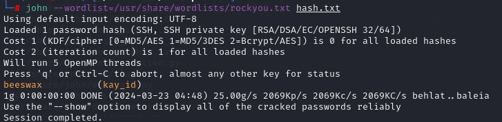

<h1>Basic Pentesting Walktrought</h1> 


TryHackMe platformunda yer alan bu makinenin çözüm yolu adım adım gösterilmektedir.
Makineye <a href="https://tryhackme.com/r/room/basicpentestingjt">buradan</a> ulaşabilirsiniz.

<h3>1-Bilgi Toplama</h3>
<p>
<h4>Rustscan:</h4>
Makineyi platform üzerinden başlattıktan sonra verilen makine 
IP sine açık portların keşfedilmesi için için RustScan aracı kullanılmıştır.
22,80,139 ve 445 portlarının açık olduğu görüldü.
</p>
<br>
<div style="text-align: center;">

</div>
<br>
<p><h4>Nmap:</h4>
    Açık olan portlar belirlendikten sonra Nmap ile portlarda çalışan servisleri, servislerin sürümlerini ve default scriptler çalıştırılarak makine hakkında daha detaylı bilgi toplanıldı.
    <br>
    
```nmap  -p 22,80,139,445 -sC -Pn -sV -T5  10.10.156.243```
<br>
<div style="text-align: center;">

</div>
<br>

</p>

| flag          | Anlamı            |
| ------------- |:-------------:|
|-p     | Sadece belirtilen portlarda tarama yapmak için kullanılır.|
| -sC   | Portlarda çalışan servisleri için tanımlanmış Scriptleri çalıştırarak bilgi toplar.|
| -sV   | Hedefteki servislerin sürümlerini tespit edilmesini sağlar |
| -Pn   | Hedefe ICMP ping gönderilmemesi için kullanılır.|
| -T5   | Tarama hızını belirler ‘5’ en hızlı seviyedir.|


<p>
<h4>Dirsearch</h4>
Web servisindeki gizli dizin ve dosyaları bulunması için dizin taraması yapıldı. Dizin taraması için ‘dirsearch’ aracı kullanıldı ve aracın default wordlist kullanıldı. 

<br>
    <div style="text-align: center;">
    
    </div>
<br>

</p>
<p>
Dizin taraması yapılırken browserdan hedef makinenin yayınlamış olduğu web adresine gidildi ve sayfa kaynağı kodları incelendiğinde yorum satırlarına alınmış
bir mesaj olduğu görüldü. Mesajda "dev notlarının kontrol et" yazıldığı görüldü ve
bir ipucu olabileceği düşünüldü.

<br>
    <div style="text-align: center;">
    
    </div>
<br>

</p>
<p>
    Yapılan dizin taramasında bulunan ‘/development’ dizini kontrol edildi ve iki adet metin dosyası olduğu görüldü.
    <br>
    <div style="text-align: center;">
    
    </div>
<br>
</p>
<p>
    İçerisinde işe yarar bilgi olup olmadığı kontrol edildiğinde dev.txt içerisinde yapılan işler ve bir versiyon bilgisi bulundu.
<br>
    <div style="text-align: center;">
    
    </div>
<br>

</p>

<p>
    j.txt içerisinde ise K kod isimli geliştiricinin /etc/shadow dosyasını okuyabildiğini ve bazı şifrelerin hashlerini kolayca  çözebildiğini bu yüzden parolo politikasına göre bu paroları değiştirmesini J kod isimli geliştiriciden istemiş.
<br>
    
 
  
<br>
</p>
<p>
    <h4>Enum4Linux:</h4>
139 ve 445 portlarında çalışan Samba SMB servislerinden bilgi toplaması için enum4linux aracı kullanıldı. Bu araç ile SMB servisinde yer alan kullanıcı adları da toplandı. Bu taramada dikkat çeken iki kullanıcı adı KAY ve JAN oldu. 
    <div style="text-align:center;">
    
    <br>
    <br>
    <br>
    
    </div>
<br>
</p>

<p>
    <h4>Hydra:</h4>
Elde edilen kullanıcı adlarından ve kolay şifre olduğuna dair bilgiye istinaden ‘hydra’ aracı ile en azından bir kullanıcının ssh servisi şifresini bulabilmek için rockyou.txt de bulunan şifreler ile kaba kuvvet saldırısı uygulandı ve jan kullanıcısının şifresi elde edildi.
<br>
    <div style="text-align: center;">
    
    </div>
<br>
</p>
<h3>2-Shell</h3>
<p>
    Elde edilen kullanıcı adı ve şifre ile ssh servisi ile makineye bağlantı sağlandı.
<br>
    <div style="text-align: center;">
    
    </div>
<br>
</p>
<h3>3-Yetki Yükseltme</h3>
<p>
    Bağlantı sağlandıktan sonra jan kullanıcısı ile ‘sudo -l’ komutu çalıştırılarak sudo yetkisinde herhangi bir komut çalıştıramadığı görüldü ve bir dizin geri giderek kay kullanıcısın dosyaları kontrol edildi.
<br>
    <div style="text-align: center;">
    
    </div>
<br>
</p>


<p>
    Kay kullanıcısının dosyalarının bazılarını okumaya yetkisini olmadığı görüldü fakat kay kullanıcısının ssh sertifikasını (.ssh/id_rsa) okuyabildiği görüldü. Saldırı yapılan makineye kopyalandı.
    
<br>
    <div style="text-align: center;">
    
    </div>
<br>
</p>
<p>
    <h4>John:</h4>
ssh2john ile sertifikanın bir şifresi var ise şifresinin hashini hash.txt dosyasına yazdırılması için çalıştırılan kod sonucunda bir hash.txt dosyası oluştuğu görüldü (eğer sertifika şifresi olmasaydı kod sonucu olarak ‘Hash not found’ mesajı döner).


<br>
    <div style="text-align: center;">
    
    </div>
<br>
</p>
<p>
    Oluşturulan hash.txt içerisindeki hash’i çözebilmesi için ‘john’ aracı kullanıldı ve kopyalamış olduğumuz kay_id sertifikasının şifresi elde edildi.
<br>
    <div style="text-align: center;">
    
    </div>
<br>

```
ssh2john sertifika_ismi>>hash.txt

john --wordlist=/usr/share/wordlists/rockyou.txt hash.txt
```
</p>
<p>
    Kopyalanmış olan sertifikaya ‘600’ yetkisi verildikten sonra Kay kullanıcısı ile hedef makineye ssh servisi ile bağlantı sağlandı
<br>
    <div style="text-align: center;">
    
    </div>
<br>

```
chmod 600 sertifika_ismi

ssh -i sertifika_ismi kay@10.10.156.243
```
</p>

<p>
    Kay kullanıcısı ile kendi diziinide yer alan pass.bak içesindeki bayrak yakalandı. 
<br>
    <div style="text-align: center;">
    
    </div>
<br>
</p>
