<h1>Basic Pentesting Walktrought</h1> 
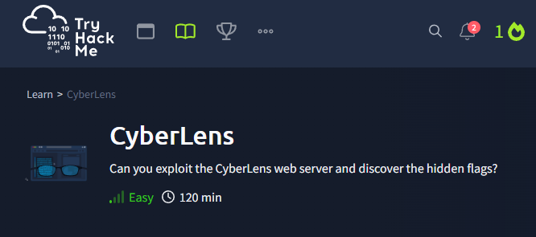

TryHackMe platformunda yer alan bu makinenin çözüm yolu adım adım gösterilmektedir.
Makineye <a href="https://tryhackme.com/r/room/cyberlensp6">buradan</a> ulaşabilirsiniz.

<p>
    Makineyi başlattıktan sonra platformdan alınan hedef IP'sini saldırı makinesinin "/etc/host" dosyasına "cyberlens.thm" şeklinde ekleme yapıldı.
    Ekleme işlemi aşağıdaki kod örneği ile yapılabilirken isteğe bağlı olarak text editörleri aracılığıyla da yapılabilmektedir
</p>
  
```sudo echo '10.10.162.97 cyberlens.thm' >> /etc/hosts```

<br>
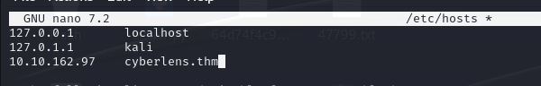
<br>

<h3>1-Bilgi Toplama</h3>
<p>
<h4>Rustscan:</h4>
Makinedeki açık portların keşfedilmesi için için RustScan aracı kullanılmıştır.
80,135,139,445,3389,5985,47001,49604,49665,49666,49667,49668,49669,49670,49677,61777 portlarının açık olduğu görüldü.
</p>
<br>
<div style="text-align: center;">
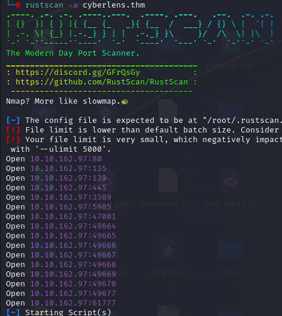
</div>
<br>
<p><h4>Nmap:</h4>
    Açık olan portlar belirlendikten sonra Nmap ile portlarda çalışan servisleri, servislerin sürümlerini ve default scriptler çalıştırılarak makine hakkında daha detaylı bilgi toplanıldı.
    Portlarda çalışan servisler incelendiğinde hedef makinenin bir Windows makine olduğu ve iki http servisi çalıştığı görüldü.
    <br>
    
```nmap  -p 80,135,139,445,3389,47001,49664-49670,49677,61777 -sC -Pn -sV -T5  cyberlens.thm```
<br>
<div style="text-align: center;">
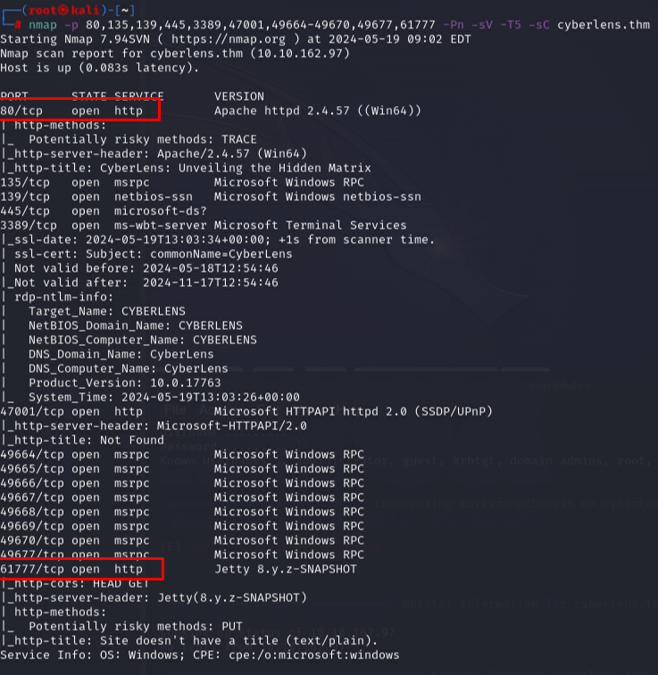
</div>
<br>

</p>

| flag          | Anlamı            |
| ------------- |:-------------:|
|-p     | Sadece belirtilen portlarda tarama yapmak için kullanılır.|
| -sC   | Portlarda çalışan servisleri için tanımlanmış Scriptleri çalıştırarak bilgi toplar.|
| -sV   | Hedefteki servislerin sürümlerini tespit edilmesini sağlar |
| -Pn   | Hedefe ICMP ping gönderilmemesi için kullanılır.|
| -T5   | Tarama hızını belirler ‘5’ en hızlı seviyedir.|
| 49664-49670   | Başlangıç ve bitiş portu verilerek aradaki portları dahil etmeyi sağlar.|


<p>
<h4>Dirsearch</h4>
Web servisindeki gizli dizin ve dosyaları bulunması için dizin taraması yapıldı. Dizin taraması için ‘dirsearch’ aracı kullanıldı ve aracın default wordlist ve default port 80 kullanıldı. 
Yapılan tarama sonrasında 80 portunda çalışan serviste önemli sayılabilecek bir dizin ile karşılaşılmamıştır.
<br>
    <div style="text-align: center;">
    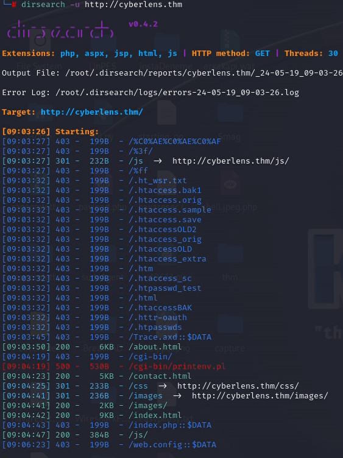
    </div>
<br>

</p>
<p>
Browserdan makine üzerinde çalışan web servisleri sırasıyla ziyaret edildi. Öncelikle 80 portunda çalışan web servisi kontrol edildiğinde
Resim dosyalarının metadatalarını çıkaran bir servis olduğu görüldü ve seçilen dosyanın hedef makineye yüklenemediği ya da erişilemediği görüldü.

<br>
    <div style="text-align: center;">
    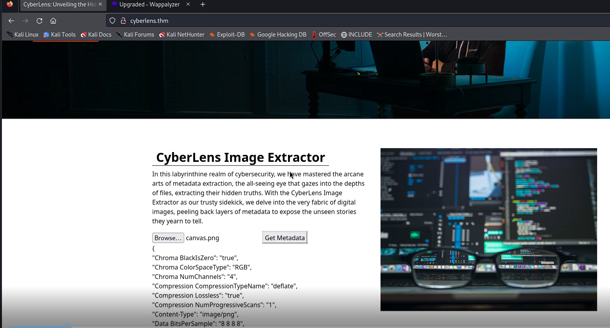
    </div>
<br>

</p>
<p>
    61777 portunda çalışan Web servisi kontrol edildiğinde bir Apache Tika (Java ile yazılmış bir içerik algılama ve analiz frameworkü) frameworkünün kullanım kılavuz sayfası olduğu görüldü.
    Sayfada frameworke ait sürüm bilgisinede ulaşıldı.
    <br>
    <div style="text-align: center;">
    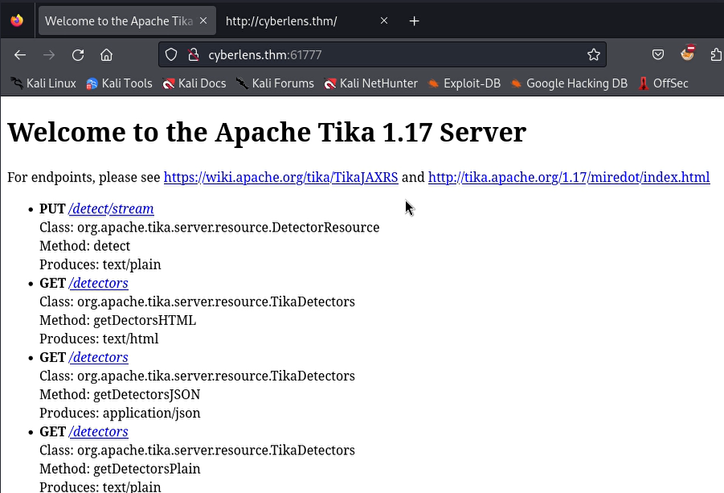
    </div>
<br>
</p>
<p>
    Sayfada erişilen framework ve sürüm bilgisinden yola çıkarak bu bilgilere ait bir exploit araması yapıldı.
    Yapılan aramaya göre bir Command Injection açığı olduğu ve metasploit içersinde çalıştırılabilir bir exploit olduğu görüldü. 
<br>
    <div style="text-align: center;">
    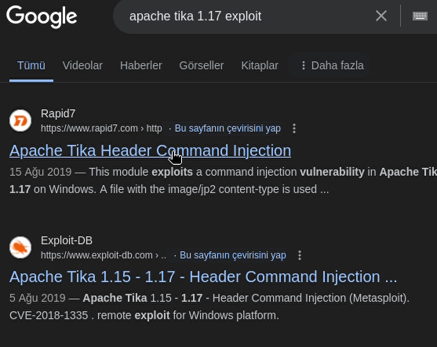
    </div>
<br>
<br>
    <div style="text-align: center;">
    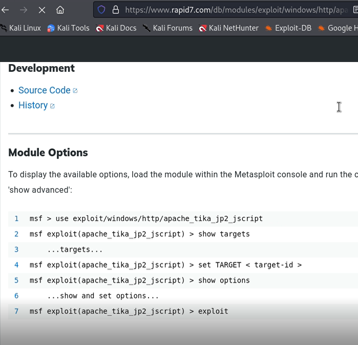
    </div>
<br>
</p>

<h3>2-Exploit:</h3>

<p>
    <h4>Metasploit:</h4>
    
    Metasploit, sistemlerdeki güvenlik açıklarını keşfetmek ve test etmek için kullanılan açık kaynak kodlu bir sızma testi aracıdır.  
    Saldırı makinesinde metasloit aracı çalıştırıldı ve bulunan exploit "use exploit_name" komutu ile seçildikten sonra "show options" komutu ile
    exploit hedef ve saldırı makinelerine göre düzenlendi.

    <br>
    
     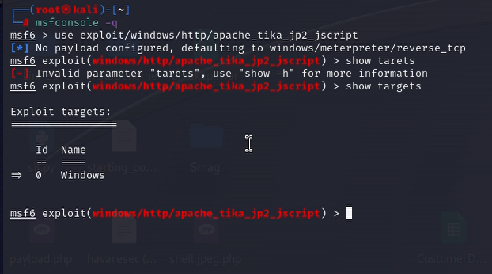
  
    <br>
    <br>
    
    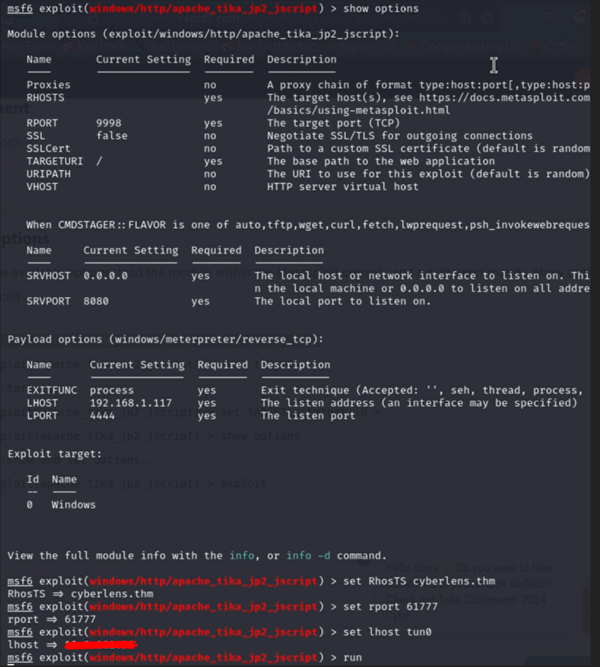
 
   <br>
</p>

<h3>3-Shell</h3>

<p>

Exploit çalıştırıldıktan sonra meterpreter bağlantısı açılıp hedef makineye bağlantı sağlandı.
Meterpreter bağlantısında "shell" komutu ile makinede cmd terminali gibi işlem yapılabilecek bağlantı elde edildi. 
    <div style="text-align:center;">
    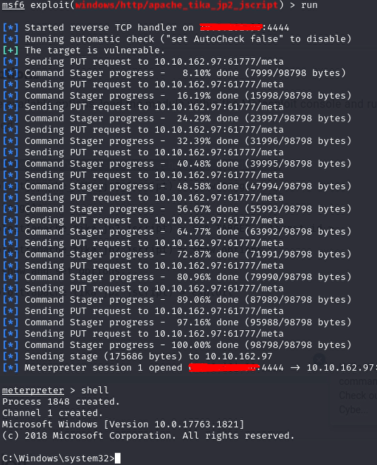
    <br>
    </div>
<br>
</p>

<p>

Shell bağlantısı ile makindeki dosyalar ve dizinler kontrol edildi. "Cyberlens" kullanıcısının /Desktop dizininde ilk bayrağın içinde olduğu user.txt dosyası bulundu.
<br>
    <div style="text-align: center;">
    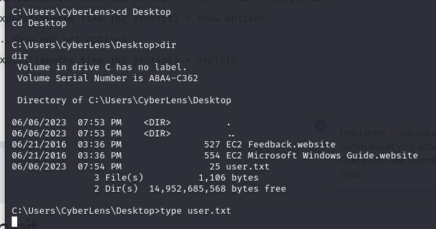
    </div>
<br>
</p>

<p>
    İlk bayrak yakalandıktan sonra dizinler kontrol edilirken "Cyberlens" kullanıcısının /Document/Management dizini altında 
    "Cyberlens" kullanıcısının giriş bilgilerinin olduğu Cyberlens-Management.txt dosyası bulundu ve giriş bilgilerine erişildi.
<br>
    <div style="text-align: center;">
    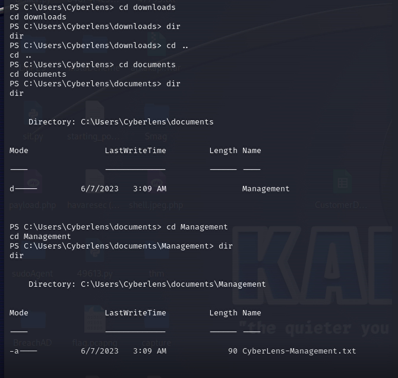
    </div>
<br>
</p>
<h3>3-Yetki Yükseltme</h3>
<p>
    Metasploit ile açık olan bağlantıda çalıştırılabilir exploitleri bulmak için bir modül bulunmakta.
    Modülü çalıştırmak için gereken parametre olarak açık olan session girildi.
    Bu modul çalıştırılarak hedef makinede çalıştırılabilecek exploitler listelendi.
<br>
    <div style="text-align: center;">
    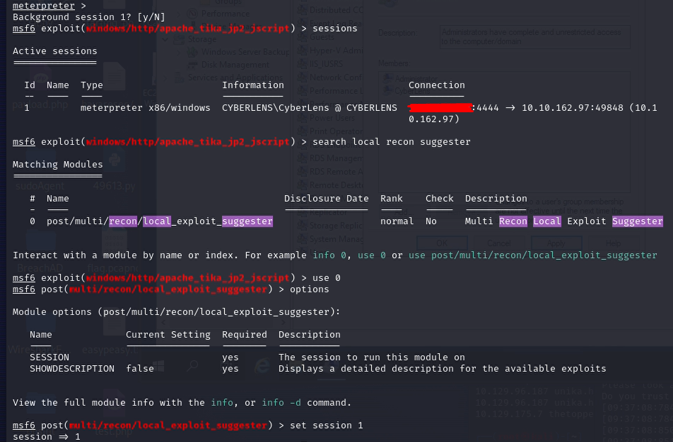
    </div>
<br>
</p>


<p>
    Çalıştırılabilir exploitler arasında "always_install_elavated" exploitini yetki yükseltmek için kullanabileceği görüldü. 

<br>
    <div style="text-align: center;">
    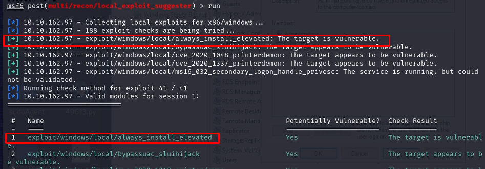
    </div>
<br>
</p>
<p>
    <h4>AlwaysInstallElavated:</h4>
Metasplit üzerinden exploiti kullanmak için "use" komutu ile exploit ismi girilidi. Gerekli paramaetlerei görmek için "show options"
kullanılarak gerekli değişiklikleri yaptıktan sonra exploit çalıştırıldı. Exploit başarılı bir şekilde çalıştıktan sonra yeni bir meterpreter bağlantısı açtığı görüldü.


<br>
    <div style="text-align: center;">
    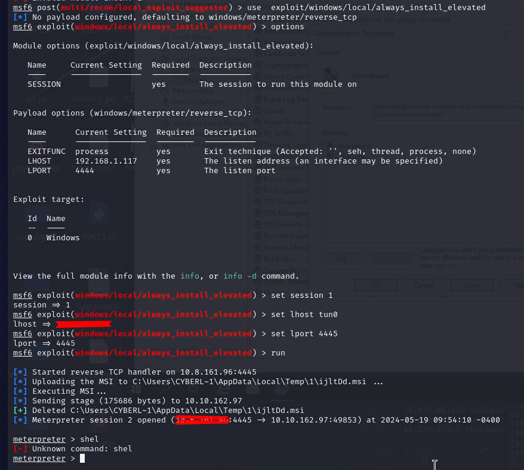
    </div>
<br>
</p>
<p>
   Açılan yeni bağlantıda shell komutu kullanılarak hedef makinede  shell bağlantısı elde edildi ve yeni bağlantıyı hangi kullanıcı ile açtığını
   anlamak için "whoami" komutu kullanıldı ve shell bağlantısının system yani üst yetkili kullanıcı ile açıldığı görüldü.
   İkinci bayrağı bulmak için kontrol edililemeyen Administror kullanıcısın dosyaları incelendiğinde, bayrak Administror kullanıcısın
   Desktop dizininde admin.txt dosyasında bulundu.
<br>
    <div style="text-align: center;">
    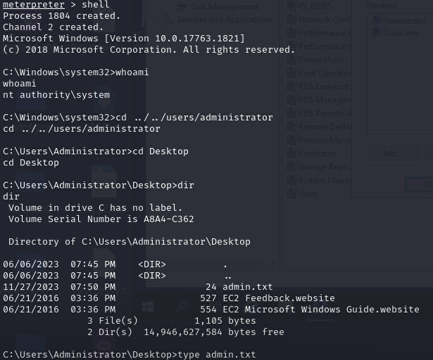
    </div>
<br>

</p>
