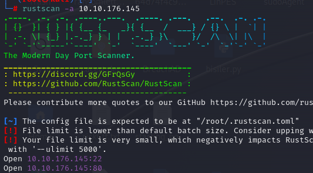
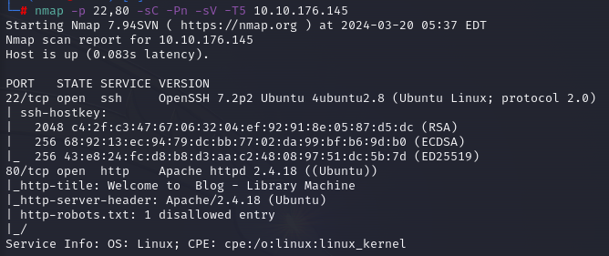
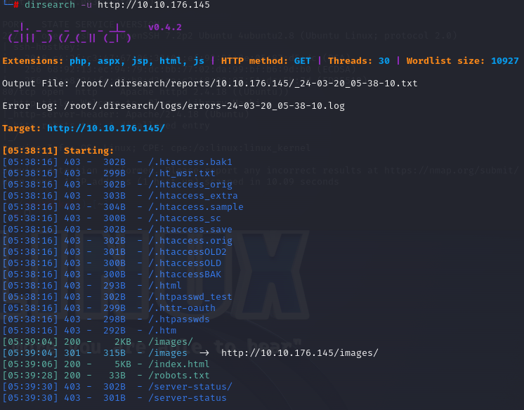
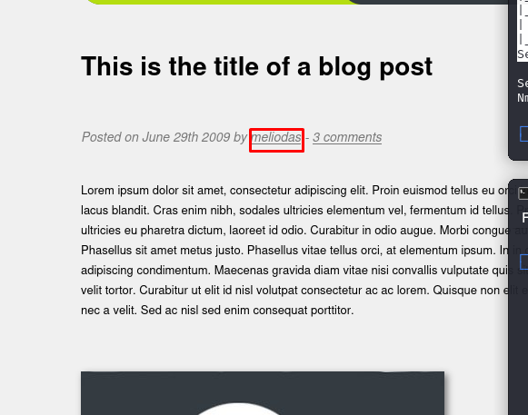
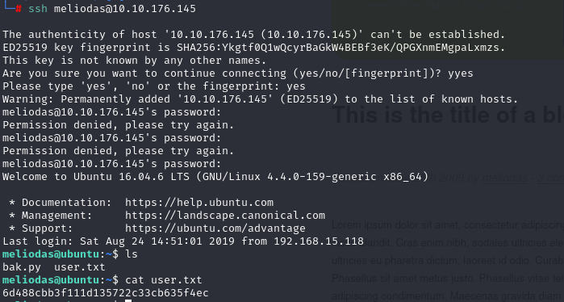
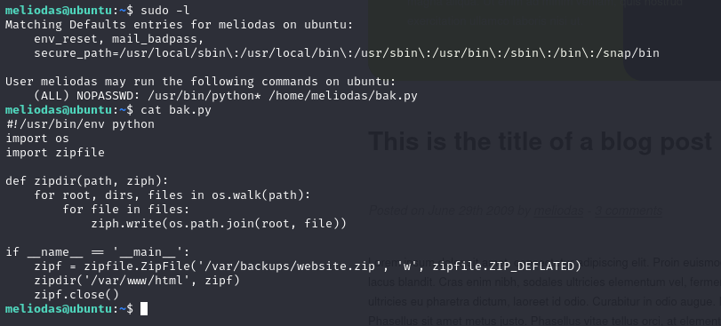
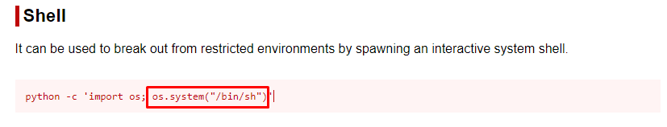
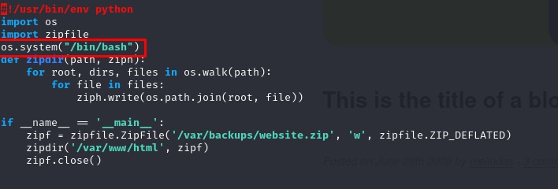
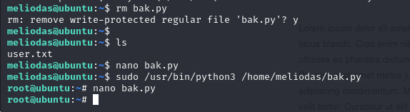

<meta charset="utf-8">
<h1>The Library Walktrought</h1> 

TryHackMe platformunda yer alan bu makinenin çözüm yolu adım adım gösterilmektedir.

<h4>1 Rustscan:</h4>
Makineyi platform üzerinden başlattıktan sonra verilen makine IP sine açık portların keşfedilmesi için için RustScan aracı kullanılmıştır.

 

 

2 Nmap:
    Açık olan portlar belirlendikten sonra Nmap ile portlarda çalışan servisleri, servislerin sürümlerini ve default scriptler çalıştırılarak makine hakkında daha detaylı bilgi toplanıldı.
    nmap  -p 22,80 -sC -Pn -sV -T5 <Target IP address>

 

 
 

| flag          | Anlamı            |
| ------------- |:-------------:|
|-p     | Sadece belirtilen portlarda tarama yapmak için kullanılır.|
| -sC   | Portlarda çalışan servisleri için tanımlanmış Scriptleri çalıştırarak bilgi toplar.|
| -sV   | Hedefteki servislerin sürümlerini tespit edilmesini sağlar |
| -Pn   | Hedefe ICMP ping gönderilmemesi için kullanılır.|
| -T5   | Tarama hızını belirler ‘5’ en hızlı seviyedir.|

3 Dirsearch
Web servisindeki gizli dizin ve dosyaları bulunması için dizin taraması yapıldı. Dizin taraması için ‘dirsearch’ aracı kullanıldı ve aracın default wordlist kullanıldı. 

 
    

    
    

 

4  Yapılan dizin taramasında bulunan ‘/robots.txt dizini kontrol edildi ve txt dosyasının içinde herhangi bir dizinin gizlenmediği fakat user-agent kısmında “rockyou” olduğu görüldü. Bunun bir bruteforce ile rockyou.txt wordlistini kullanmamız gerektiğini belirten bir ipucu olduğu düşünüldü.
Alınan ipucunun kullanımı için bir kullanıcı adına da ihtiyaç olduğu için web site incelendiğinde bir blog yazarının adı dikkat çekti.

 
    

    
    

 

    Blog yazarının kullanıcı adı ile password kısmı için rockyou.txt olacak şekilde ssh servisine bruteforce saldırısı gerçekleştirildi ve biraz bekledikten sonra kullanıcının şifresi elde edildi.
     
    

    
    

 

Kullancı adı ve parola ile makineye ssh servisinden bağlantı kurulup Shell bağlantısı alındı. /home dizinindeki kullanıcı dizindeki dosyalar kontrol edildiğinde ilk bayrak elde edildi.
 
    

    
    

 

Yetki yükseltmek için “sudo -l” komutu çalıştırılarak hangi araçların üst yetki ile çalıştırılabileceği listelendi. Listeleme üzerine kullanıcın dizinindeki bak.py dosyasını python ile üst yetki ile çalıştırabileceği görüldü ve dosya cat komutu ile incelendi
 
    

    
    

 

GFTOBins sitesinden python için Shell komutu incelendi ve çalıştırılacak dosyaya komut eklelendi. 
 
    

    
     
     
    
    

 

Gerekli düzenlemeler yapıldıktan sonra “sudo” komutu ile python scripti çalıştırıldığında yeni bir Shell in root kullanıcısı ile açıldığı görüldü. İkinci bayrak /root dizini altında bulundu.
 
    

    
    

 

