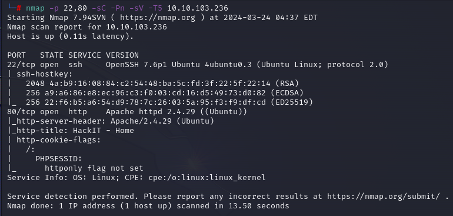

<h1>RootMe Walktrought</h1> 


TryHackMe platformunda yer alan bu makinenin çözüm yolu adım adım gösterilmektedir.
Makineye <a href="https://tryhackme.com/r/room/rrootme">buradan</a> ulaşabilrisiniz
>
<p>
<h3>1-Enumarion</h3>
<h4>Rustscan:</h4>
Makineyi platform üzerinden başlattıktan sonra verilen makine 
IP sine açık portların keşfedilmesi için için RustScan aracı kullanılmıştır.
22 ve 80 portlarının açık olduğu görüldü.
</p>
<br>
<div style="display: flex; justify-content: center;">

</div>
<br>
<p> <h4>Nmap:</h4>
    Açık olan portlar belirlendikten sonra Nmap ile portlarda çalışan servisleri, servislerin sürümlerini ve default scriptler çalıştırılarak makine hakkında daha detaylı bilgi toplanıldı.
    <br>
</p>

``` nmap  -p 22,80 -sC -Pn -sV -T5  10.10.156.243```
<br>
<div style="display: flex; justify-content: center;"">

</div>

<br>

| flag          | Anlamı            |
| ------------- |:-------------:|
|-p     | Sadece belirtilen portlarda tarama yapmak için kullanılır.|
| -sC   | Portlarda çalışan servisleri için tanımlanmış Scriptleri çalıştırarak bilgi toplar.|
| -sV   | Hedefteki servislerin sürümlerini tespit edilmesini sağlar |
| -Pn   | Hedefe ICMP ping gönderilmemesi için kullanılır.|
| -T5   | Tarama hızını belirler ‘5’ en hızlı seviyedir.|


<p>
<h4>Dirsearch</h4>
Web servisindeki gizli dizin ve dosyaları bulunması için dizin taraması yapıldı. Dizin taraması için ‘dirsearch’ aracı kullanıldı ve aracın default wordlist kullanıldı. 

<br>
    <div style="display: flex; justify-content: center;">
    
    </div>
<br>

</p>
<p>
Yapılan dizin taramasında bulunan “/panel” dizini kontrol edildiğinde bir dosya yükleme sayfası olduğu görüldü. 


<br>
    <div style="display: flex; justify-content: center;">
    
    </div>
<br>

</p>
<h3>2-File Upload</h3>
<p>
    ilk olarak bir ReverseShell içeren bir php dosyası yüklemeye çalışıldı fakat  yükleme kısmında php uzantısına izin verilmediği görüldü
    <br>
    <div style="display: flex; justify-content: center;">
    
    </div>
<br>
</p>
<p>
    Php dosyası gibi çalışan fakat uzantısı php olmayan uzantıları bulmak için yapılan aramada karşımıza çıkan sitede bazı uzantılar bulundu.
<br>
    <div style="display: flex; justify-content: center;">
    
    </div>
<br>

</p>

<p>
    Hangi uzantının işe yaradığını bulmak için Burpsuite açarak, dosya yükleme isteğini yakalayıp istekte bulunan dosya uzantı kısmındaki php  seçilerek, istek  intruder a gönderildi.
<br>
    

  
<br>
</p>
<p>
    İntruder sekmesindeli sniper kısmına, sitede bulunan uzantılar liste halinde eklenerek farklı uzantılar ile istek tekrar tekrar gönderildi. 
    <div style="text-align:center;">
    
    <br>
    <br>
    <p>
        Gönderilen isteklerin sonuçları kontrol edildiğinde .phtml uzantısının başarılı bir şekilde siteye yüklendiği görüldü.
    <br>
    
    </p>
</div>
<br>
</p>
<h3>4-Reverse Shell</h3>
<p>
    Terminal ekranından netcat aracı ile yüklenen reverseshell deki port dinlemeye alınarak, browserdan sitedeki yüklenen dosyaya istek gönderildiğinde Shell bağlantısının gerçekleştiği görüldü.
<br>
    <div style="text-align: center;">
    
    </div>
<br>
</p>
<h3>5-Birinci Bayrak</h3>
<p>
    İlk bayrağı bulmak için çağırılan komut ile bayrağın dizini öğrenilip bayrak yakalanmıştır.
<br>
    <div style="text-align: center;">
    
    </div>
<br>
</p>

``` find / -type f -name user.txt 2> /dev/null```

<h3>6-Yetki Yükseltme</h3>
<p>
    Yetki yükseltmek için çalıştırılan kod ile sahibi root olan setuid biti ayarlanmış olan dosyaları listelendi bu dosyalar araştırılarak hangisi ile root yetkisinde bir shell alınabileceği belirlendi. 
<br>
    <div style="text-align: center;">
    
    </div>
<br>
</p>

``` find / -type f -user root -perm -u=s 2> /dev/null```

<p>
    GFTOBins sitesinden belirlenen tool ile yetki yükseltmeye yaracak kodlar makinede çalıştırılarak yetki yükseltildi ve root yetkisinde bir bağlantı elde edildi. İkinci bayrak /root dizini altında bulunarak, bayrak yakalandı.
    <div style="text-align: center;">
    
    
    </div>
<br>
</p>

